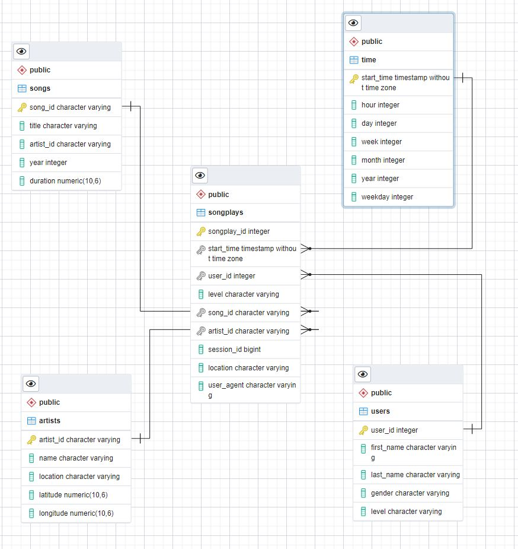

# Introduction
> A startup called Sparkify collects users data that describe songs and users activities on their app. The analytics team tries to
> understand what songs their users listen to. Currently, the data is collected in form of json files that 
> contain logs on user activity on the app as well as data about songs on their app. This project aims to organize data in a database that allows to
> analyze user activities and draw conclusions about it. In order to achieve more user-friendly interface and access to data,
> the database needs to be designed.


# Database schema design and ETL pipeline.

## Files 
In order to achieve analytics goals, we decided to use Postgres database, which is open source and allows 
to do aggregations and joins. Thus, this type of database is a perfect match for our needs. The project directory contains 
the following files:
1. create_tables.py
2. sql_queries.py
3. etl.py
4. test.ipynb

The create_tables.py file creates a database and then it carries out instructions for creating and dropping tables. 
The sql_queries.py describes  SQL queries that we run in the create_tables.py file. 
Once the database is created, we can run etl.py file to populate our empty  tables.
The test.ipynb allows to carry out manual tests to see if all previous operations were correct.

## Database design
For this database, we decided to choose a star schema, which is easy to build. It is optimized for analytics tasks. In
the center of star schema, one can find a fact table, which is in our case a songplays table. Then, we have several dimensions
tables connected to the  songplays table: <br>
   * users table 
* songs table
* artists table
* time table

The image below shows all tables in the database and their relationships between them:
 


# Usage example
Lets select only users that used the app before the date of 2018-11-2
```
SELECT *
FROM public.songplays as sp
join users u on u.user_id = sp.user_id 
WHERE
    start_time < '2018-11-2'
```
__Query results:__ 


# Author
Project made for Udacity during the Data Engineering Nanodegree by Teodor Wisniewski